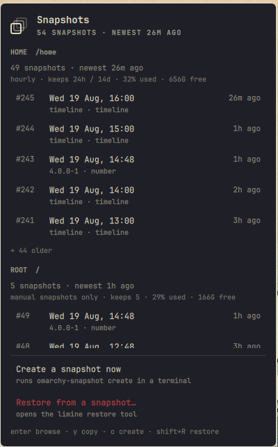

# Snapshots

Snapper snapshots in the Omarchy bar — and an answer to the question the
snapshot list itself never answers: **can this machine actually be rolled back
right now?**

Omarchy installs snapper and `limine-snapper-sync` on every machine, then never
mentions them again. Snapshots accumulate quietly, the boot menu quietly stops
being updated, and you find out which of those is true on the morning you needed
a rollback. This widget puts that state in the bar.



## What it tells you

- **Per config** — `root` and `home` each get their own section: how many
  snapshots exist, how old the newest one is, the retention policy actually in
  force (`hourly · keeps 24h / 14d`, or `manual snapshots only`), and filesystem
  usage.
- **Recent snapshots** — number, timestamp, relative age, and what made it, so
  an Omarchy update snapshot (`4.0.0-1 · number`) is distinguishable from an
  hourly one (`timeline · timeline`) at a glance.
- **Whether recovery is reachable** — the bar turns urgent when
  `limine-snapper-sync` has stopped (new snapshots will not reach the boot menu,
  which is where a rollback is chosen), or when `snapper-timeline.timer` has
  stopped taking them in the first place.
- **What you can do about it** — browse a snapshot to recover a file, create one
  now, delete one you no longer want, or open Omarchy's restore tool.
- **Quieter problems** — cleanup timer stopped, a timeline config that has
  recorded nothing for hours, or a filesystem past the usage ceiling at which
  `limine-snapper-sync` stops adding boot entries.

The bar only changes colour for a real failure. An unread config or a stale
timer is reported inside the panel, because a widget that ships permanently
yellow is a widget people learn to ignore.

## Recovering one file

The common case is not rolling back a machine — it is wanting one file back the
way it was two hours ago. Every snapshot row is a real read-only directory, so
**enter** opens the selected snapshot in your file manager and **y** copies its
path for the terminal. No privilege, no restore, nothing rewritten: just the old
tree, sitting there to be copied out of.

## Read access, and why a config might be missing

snapper shows a config only to users listed in that config's `ALLOW_USERS`. On a
stock Omarchy install that list is empty, so a user session sees "No
permissions." for `root` — this is snapper working as configured, not a fault.

When the panel finds a config it cannot read, it says so on that config's own
row and offers the fix. Confirming opens a terminal running exactly:

```bash
sudo snapper -c root set-config ALLOW_USERS=$USER SYNC_ACL=yes
```

`SYNC_ACL` puts an ACL on that config's `.snapshots` directory, after which this
widget reads it with no privilege at all. The command runs in a visible terminal
so the sudo prompt and the result are yours to see.

> Note: `set-config ALLOW_USERS=` **replaces** that config's existing user list.
> If you have already granted other users, edit `/etc/snapper/configs/<config>`
> by hand instead.

## Deleting a snapshot

`x` on a selected snapshot deletes it, after a confirmation naming the snapshot
and its config.

snapper lets the users in a config's `ALLOW_USERS` create *and* delete its
snapshots, so for those configs this runs in place with no privilege and no
terminal — the panel reports the result, including snapper's own refusal when
you aim at the active or default snapshot. For a config you are not on, it falls
back to a visible terminal running `sudo snapper -c <config> delete <number>`.

## What it never does

- No privileged command runs in the background. Reading is unprivileged, and
  every action that does need root — creating, restoring, granting access, and
  deleting on a config you are not allowed on — is handed to a terminal you can
  watch.
- Creating and restoring go through Omarchy's own commands
  (`omarchy-snapshot create`, `omarchy-snapshot restore`) rather than
  reimplementing them.
- Restoring and deleting ask first, and every dialog opens with **Cancel**
  selected — Enter is never the fast path to destroying a snapshot or to
  rewriting what the machine boots into.
- `/boot` is mode `700` on Omarchy, so boot entries can never be verified from a
  user session. The panel reports the sync service's state and says nothing
  about entries it cannot see.
- Nothing snapper reports is treated as trusted text. Snapshot descriptions are
  chosen by whoever created the snapshot, so every string is stripped of markup
  and length-clamped as it enters the model, and every `Text` item is pinned to
  `Text.PlainText`. QML's default `AutoText` would treat a description like
  `` as rich text and make the shell fetch it.

## Keyboard

Inside the panel:

| Key | Action |
|---|---|
| `j` / `k` or arrows | move the cursor |
| `enter` | browse the selected snapshot |
| `y` | copy the selected snapshot's path |
| `x` | delete the selected snapshot (asks first) |
| `c` | jump to *Create a snapshot* |
| `shift+R` | restore (asks first) |
| `r` | refresh |
| `esc` | close |

In a confirmation dialog, `left`/`right`/`tab` pick a button, `enter` activates
it, and `esc` cancels. Every dialog opens with **Cancel** selected.

On the bar icon: left click opens the panel, right click refreshes.

## Install

```bash
omarchy plugin add https://github.com/ianswope/omarchy-snapshots.git --enable
```

To choose where it sits:

```bash
omarchy bar move ianswope.snapshots --section right
```

## Remove

```bash
omarchy plugin remove ianswope.snapshots
```

That disables the widget, drops it from the bar layout, and deletes
`~/.config/omarchy/plugins/ianswope.snapshots`. The plugin stores no state of its
own and changes nothing outside that directory, so nothing is left behind.

Any snapper config you granted read access to stays granted — that is a snapper
setting, not a plugin one. To undo it:

```bash
sudo snapper -c root set-config ALLOW_USERS="" SYNC_ACL=no
```

## Settings

All three are editable from the widget's settings in the bar, or in
`~/.config/omarchy/shell.json`:

| Setting | Default | Meaning |
|---|---|---|
| `refreshIntervalSec` | `120` | how often to re-read snapshot state |
| `snapshotsPerConfig` | `5` | snapshots listed per config before "+ N older" |
| `showCount` | `true` | show the total snapshot count beside the bar icon |

## Requirements

| Dependency | Needed for |
|---|---|
| Omarchy Quattro (`omarchy-shell`) | the plugin host |
| `snapper` | everything |
| `jq` | the status helper |
| `bash`, `coreutils`, `systemd` | `date`, `df`, `awk`, `systemctl` |
| `limine-snapper-sync` | boot-menu health; absent is fine and never warned about |
| `nautilus` | browsing a snapshot (**enter**) |
| `wl-clipboard` | copying a path (**y**) |
| `omarchy-snapshot` | creating and restoring |

Everything except `snapper` and `jq` degrades quietly when missing.

## How it reads state

All collection lives in one script that prints a single JSON document, so what
the panel believes can be checked directly:

```bash
~/.config/omarchy/plugins/ianswope.snapshots/bin/omarchy-snapshots-status | jq
```

It is a reporter: it creates, deletes and restores nothing, and every command it
runs is unprivileged (`snapper list`, `snapper get-config`, `systemctl show`,
`df`). Health is judged separately in `Model.js`, so the script stays useful on
its own for working out why the widget is showing what it shows.

## License

MIT — see [LICENSE](LICENSE).
